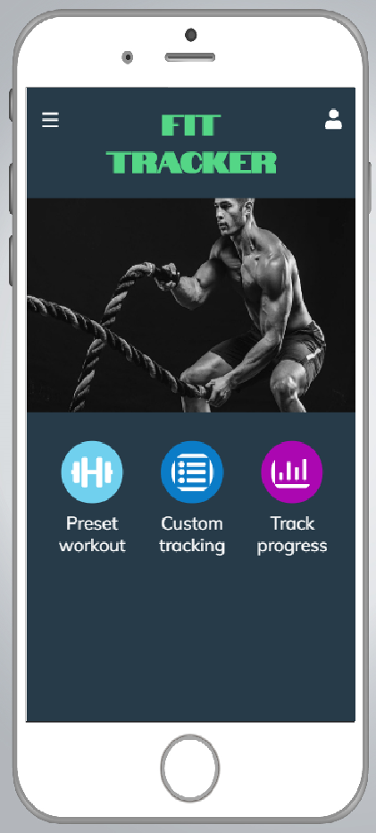

# Fit Tracker

## About
Fit Tracker is a tool that help users keep track of the weights they lift throughout 12 weeks. 

Users have the option to set their own exercises to track or use the preselected exercises. 

## Technologies Used:

